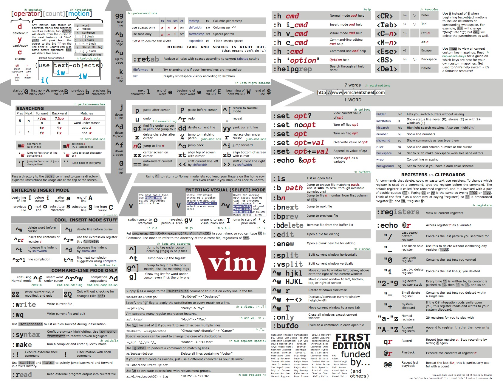

# Утилиты для дебага (centos7)

* [net-tools](https://www.opennet.ru/docs/RUS/lfs5/appendixa/net-tools.html) - анализ сетевых подключений

Использование:

`netstat -nltp` - для просмотра TCP соеденений и портов

`netstat -nlup` - для просмотра UDP соеденений и портов


* [sysstat](https://github.com/sysstat/sysstat) - информация о дисковой подсистеме

Использование:

`iostat -ktx 1` - получение информации о состоянии дисков с обновлением в 1с


* [htop](https://htop.dev/) - общая информация о системе

* [nload](https://github.com/rolandriegel/nload) - информация о состоянии сетевых интерфейсов и траффика

* [tcpdump](https://www.tcpdump.org/) - сниффинг сетевого траффика

* [lsof](https://man7.org/linux/man-pages/man8/lsof.8.html) - информация об открытых файлах процесса

Использование:

`lsof -p <pid>`

Использование:

`tcpdump -i <interface|any> host <host> and port <port>`


# Прочие команды:
* `df -h` - информация о размере и утилизации дискового пространства
* `ifconfig` или `ip a` - информация о сетевых интерфейсах системы
* `free -m` - информация о текущем состоянии оперативной памяти


# Скрипты из лекции:

## Скрипт простейшей сетевой нагрузки
```shell script
while true; do
    curl 127.0.0.1:80 &
done
```


## Скрипт простешей дисковой нагрузки
```shell script
for i in {1..20}; do
    dd if=/dev/zero of=/tmp/random_$i bs=1M count=1000 &
done
```

## Команда загрузки оперативной памяти в 1.5 раза больше доступной (пакет stress-ng)
`stress-ng --vm-bytes $(awk '/MemFree/{printf "%d\n", $2 * 1.5;}' < /proc/meminfo)k --vm-keep -m 1` 


# Полезное:
* Книга "Systems Performance 2nd Edition Book" - Brendan Gregg
* Книга "Современные операционные системы" - Эндрю Таненбаум
* [Advanced Bash-Scripting Guide](https://www.opennet.ru/docs/RUS/bash_scripting_guide/)
* vim (:wq)
